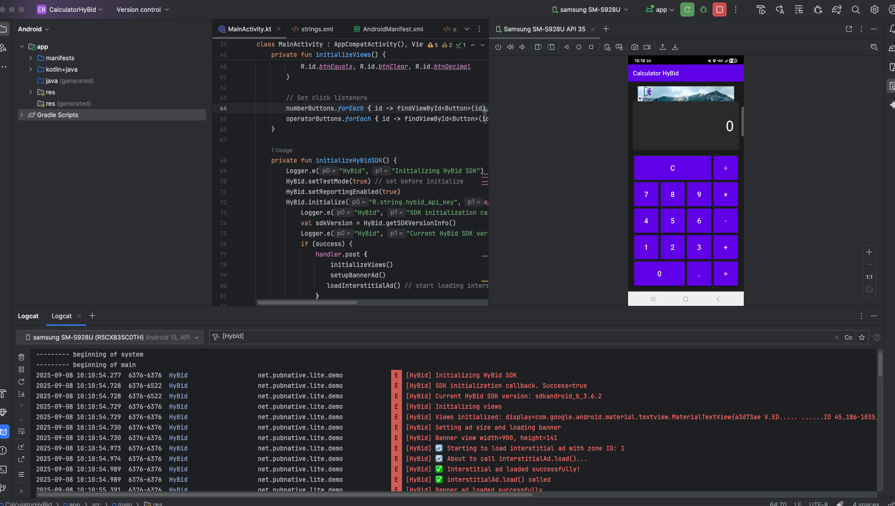

# Calculator App with HyBid SDK Integration
Android calculator app integrated with HyBid SDK for displaying banner and interstitial advertisements.
Features

 - Basic calculator operations (+, -, ×, ÷)
 - HyBid Banner Ad integration
 - HyBid Interstitial Ad (shows after calculations)
 - Portrait orientation optimized

Screenshots
The app includes:

Banner Ad - Displayed at the top of the calculator
Calculator Interface - Clean, modern design with number pad
Interstitial Ad - Full-screen ad shown after completing calculations

HyBid SDK Integration
Banner Ads

Loaded automatically when the app starts
Displayed at the top of the calculator interface
Uses HyBidAdView component

Interstitial Ads

Triggered after each calculation (when equals button is pressed)
Full-screen ad experience
Automatically reloads for subsequent calculations

Setup Instructions

1. Prerequisites

Android Studio
Android SDK 21+ (Android 5.0+)
Valid HyBid account with app token and zone IDs

2. Configuration

Open app/src/main/res/values/strings.xml.

Add the following placeholders (replace with your actual HyBid credentials):

<resources>
    <string name="hybid_app_token">YOUR_APP_TOKEN_HERE</string>
</resources>

In the Kotlin code, these values are automatically read using:

val appToken = getString(R.string.hybid_app_token)

3. Build and Run

Clone the repository
Open in Android Studio
Sync project with Gradle files
Build and run on your device/emulator

Project Structure

app/
├── src/main/
│   ├── java/com/example/calculator-hybid/
│   │   └── MainActivity.kt              # Main app logic and HyBid integration
│   ├── res/
│   │   ├── layout/
│   │   │   └── activity_main.xml        # UI layout with calculator and ads
│   │   ├── values/
│   │   │   ├── styles.xml               # App themes and button styles
│   │   │   └── strings.xml              # String resources
│   │   └── AndroidManifest.xml          # App permissions and activities
│   └── build.gradle    

// HyBid SDK
implementation 'net.pubnative:hybid-sdk:3.6.2'

